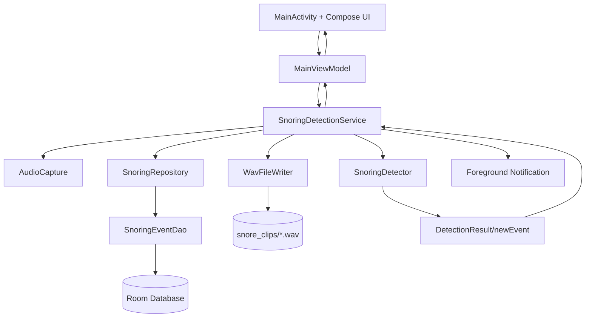

# 模块交互图 / 组件关系图

```mermaid
graph TD
    UI[MainActivity + Compose UI] --> VM[MainViewModel]
    VM --> SVC[SnoringDetectionService]

    SVC --> CAP[AudioCapture]
    SVC --> DET[SnoringDetector]
    SVC --> WAV[WavFileWriter]
    SVC --> REP[SnoringRepository]
    REP --> DAO[SnoringEventDao]
    DAO --> DB[(Room Database)]

    WAV --> FILE[(snore_clips/*.wav)]
    SVC --> NOTI[Foreground Notification]

    DET --> RES[DetectionResult/newEvent]
    RES --> SVC
    SVC --> VM
    VM --> UI
```
