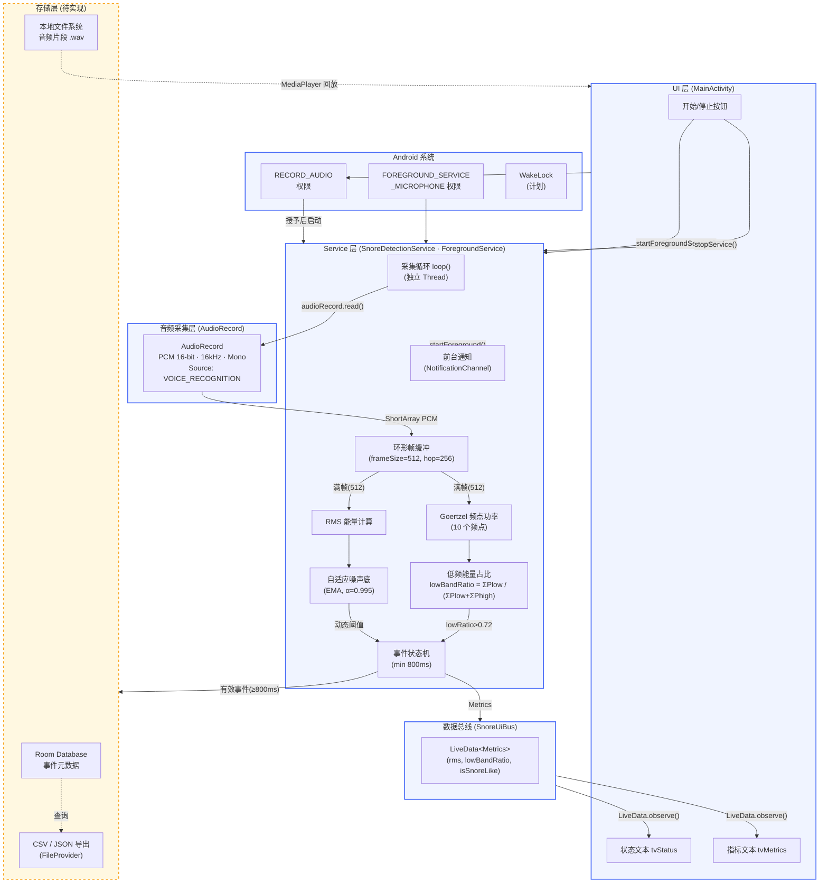
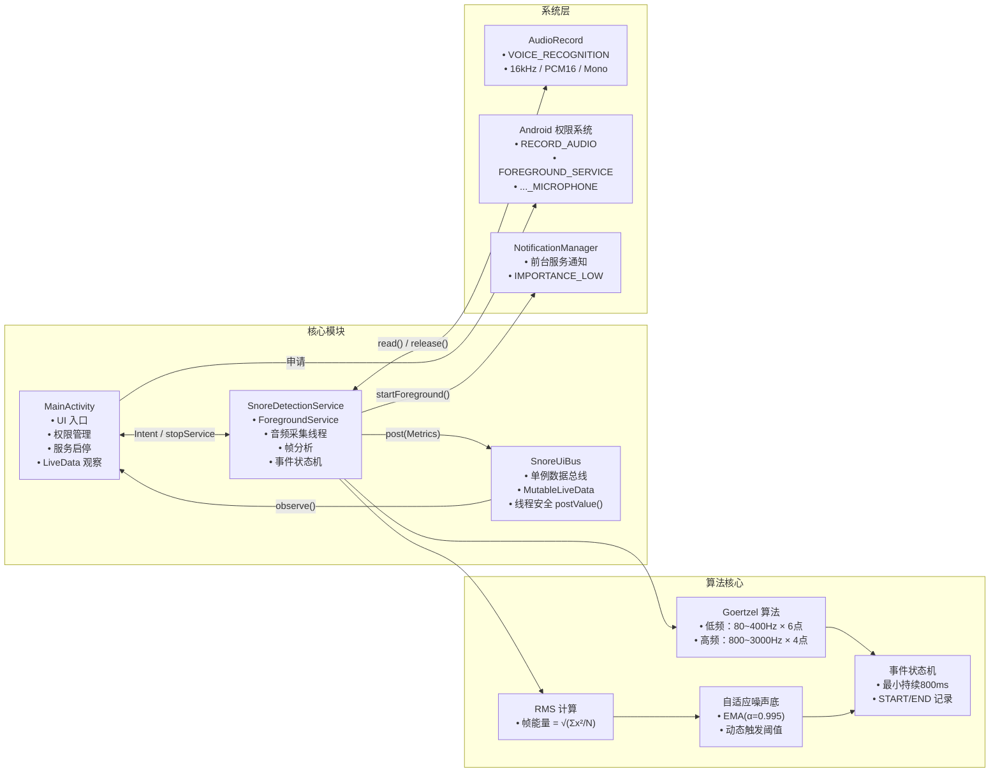

# 架构 / 模块图

SnoreGuard 应用的模块关系与数据流向。

## 架构总览

## 模块职责说明

## 数据流向说明

| 数据 | 来源 → 目标 | 传输方式 |
|------|------------|---------|
| PCM 采样 | `AudioRecord` → 帧缓冲 | `audioRecord.read()` 同步写入 |
| 帧分析结果 | `SnoreDetectionService` → `SnoreUiBus` | `SnoreUiBus.post()` (`postValue`) |
| UI 指标更新 | `SnoreUiBus` → `MainActivity` | `LiveData.observe()` 主线程回调 |
| 事件记录（待实现） | `SnoreDetectionService` → Room DB | Coroutine / Room DAO |
| 音频片段（待实现） | 帧缓冲 → `.wav` 文件 | `FileOutputStream` + WAV 头写入 |
| 导出（待实现） | Room DB → 文件 | FileProvider + Intent.ACTION_SEND |
