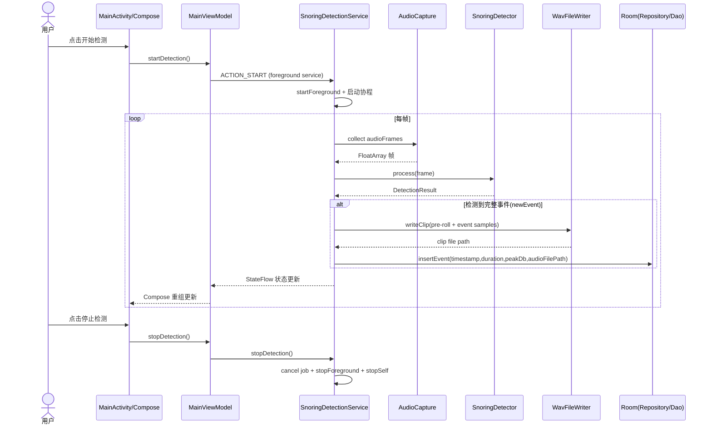

# 运行时序图

```mermaid
sequenceDiagram
    actor User as 用户
    participant UI as MainActivity/Compose
    participant VM as MainViewModel
    participant SVC as SnoringDetectionService
    participant CAP as AudioCapture
    participant DET as SnoringDetector
    participant WAV as WavFileWriter
    participant DB as Room(Repository/Dao)

    User->>UI: 点击开始检测
    UI->>VM: startDetection()
    VM->>SVC: ACTION_START (foreground service)
    SVC->>SVC: startForeground + 启动协程

    loop 每帧
      SVC->>CAP: collect audioFrames
      CAP-->>SVC: FloatArray 帧
      SVC->>DET: process(frame)
      DET-->>SVC: DetectionResult
      alt 检测到完整事件(newEvent)
        SVC->>WAV: writeClip(pre-roll + event samples)
        WAV-->>SVC: clip file path
        SVC->>DB: insertEvent(timestamp,duration,peakDb,audioFilePath)
      end
      SVC-->>VM: StateFlow 状态更新
      VM-->>UI: Compose 重组更新
    end

    User->>UI: 点击停止检测
    UI->>VM: stopDetection()
    VM->>SVC: stopDetection()
    SVC->>SVC: cancel job + stopForeground + stopSelf
```
